<h1 align="center">Alok Kumar Mishra</h1>

<strong>Security Researcher | Application Security | Reverse Engineering | Backend & AI Systems</strong>

  I work at the intersection of cybersecurity, reverse engineering, backend engineering, and applied AI for
  finance-focused systems, with an emphasis on secure architecture, deep technical analysis, and production-grade execution.

  
  
  
  
  
  

  
  
  

## About Me

I specialize in application security, Android reverse engineering, backend engineering, and AI-assisted systems for security and financial workflows. My work spans vulnerability assessment, dynamic instrumentation, binary analysis, secure API development, retrieval-augmented systems, and technically rigorous problem solving across engineering and research.

## Focus Areas

- Application security, VAPT, bug bounty research, and secure software practices.
- Android reverse engineering, Frida-based instrumentation, and binary analysis workflows.
- Full-stack and backend systems built with React, Next.js, Node.js, FastAPI, Firebase, and REST APIs.
- AI and finance systems involving RAG, NLP, vector search, Neo4j, Gemini API, Basel III, and NPA/CRAR-oriented analysis.

## Selected Highlights

- Recognized in the MeitY Hall of Fame for securing DigiLocker.
- Active open source contributor in the Rizin ecosystem.
- Building AI-driven analytics and security-oriented engineering systems with a focus on depth, reliability, and real-world applicability.

## Technical Competencies

### Languages

  
  
  
  
  
  
  
  
  
  
  
  
  

### Security And Reverse Engineering

  
  
  
  
  
  
  
  
  
  
  
  

### Web And Backend

  
  
  
  
  
  
  

### AI And Finance

  
  
  
  
  
  
  

### Tooling And Platforms

  
  
  
  
  
  

## GitHub Analytics

  
  

  

  
<strong>Extended Analytics</strong>

   
  

    
  

  

    
  

