<!-- Cards in ./profile are refreshed daily by .github/workflows/profile.yml -->

<h1 align="center">Alok Kumar Mishra</h1>

  <strong>Security Researcher &amp; Developer</strong> 
  Acknowledged by Govt. of India · GSoC 2026 @ Rizin · AppSec, reverse engineering, AI/finance systems

  
  
  
  
  
  

  <a href="https://indalok.github.io">Portfolio</a> ·
  <a href="https://indalok.github.io/projects/">Projects</a> ·
  <a href="https://indalok.github.io/contributions/">Open Source</a> ·
  <a href="https://indalok.github.io/writing/">Writing</a> ·
  <a href="https://indalok.github.io/resume/">Resume</a>

---

## About

I work on application security, Android reverse engineering, and production systems where retrieval, risk, and correctness matter. Recent work includes responsible disclosure on national-scale infrastructure, core contributions in the Rizin ecosystem, and browser-based binary analysis.

## Focus

- **GSoC 2026 @ [Rizin](https://github.com/rizinorg)** - building [rz-frida](https://github.com/rizinorg/rz-frida), the Frida plugin for Rizin (device attach, session lifecycle, packaging).
- **Open source** - merged work across `rizin`, `rz-frida`, Cutter, and the rest of [rizinorg](https://github.com/rizinorg).
- **Security research** - AppSec, Android RE, and vulnerability assessment with responsible disclosure.

## Selected work

| Project | What it is | Links |
| --- | --- | --- |
| **rz-frida** | GSoC 2026 Frida plugin for Rizin: attach/spawn, session lifecycle, and installable packaging. | [repo](https://github.com/rizinorg/rz-frida) |
| **DigiLocker** | 10+ critical/high findings on India's national document wallet (500M+ users). Credited by MeitY. | [credits](https://www.digilocker.gov.in/web/about/credits) |
| **RzWeb** | Full Rizin-based reverse engineering in the browser via WebAssembly, plus the rzwasi build path. | [repo](https://github.com/IndAlok/rzweb) · [demo](https://rizin.pages.dev/) |
| **Arthyx** | Retrieval and risk analysis over 500+ page filings (Basel III, NPA/CRAR, Neo4j). | [repo](https://github.com/IndAlok/Arthyx) · [demo](https://arthyx.pages.dev/) |
| **NSure-AI** | Hybrid BM25 + vector retrieval for insurance PDFs; hackathon-winning RAG stack. | [repo](https://github.com/IndAlok/NSure-AI) · [demo](https://nsure-ai-indalok.vercel.app/) |

## Highlights

- Officially acknowledged by the Government of India for DigiLocker security research.
- Google Summer of Code 2026 contributor with Rizin (`rz-frida`).
- Active contributor in rizinorg (core, plugins, Cutter, packaging).
- 1st place team lead, Can You Hack It (200+ participants); top-20 / 700+ at IIT Gandhinagar Hack To Future.
- Regular CTF competitor with open-category finishes in the top 20 / 50 / 100.

## Writing

- [GSoC - Rizin: Week 3](https://indalok.medium.com/gsoc-rizin-week-3-570c186bfa1a) - Jun 2026
- [GSoC - Rizin: Week 2](https://indalok.medium.com/gsoc-rizin-week-2-67d3e4eea88e) - Jun 2026
- [GSoC - Rizin: Week 1](https://indalok.medium.com/gsoc-rizin-week-1-d3f86aa326d8) - May 2026
- [BYPASS CTF 2025 (Writeups)](https://indalok.medium.com/bypass-ctf-2025-writeups-4da596940c03) - Jan 2026
- [HelloWorld, Goodbye Protection: Disassembling a Broken DEX Challenge](https://indalok.medium.com/helloworld-goodbye-protection-disassembling-a-broken-dex-challenge-b8b34d6e08d8) - May 2025

More on [Medium](https://indalok.medium.com) and the [writing page](https://indalok.github.io/writing/).

## Stack

| Area | Tools |
| --- | --- |
| **Languages** | Python, C/C++, Rust, Go, Java, TypeScript, JavaScript, Bash, SQL, Smali |
| **Security** | VAPT, AppSec, Android RE, Frida, Ghidra, IDA, JEB, Rizin, Radare2, Burp |
| **Engineering** | React, Next.js, Node.js, FastAPI, Firebase, Docker, Linux |
| **AI / Finance** | RAG, NLP, vector search, Neo4j, Gemini, Basel III |

## Activity

Cards below are committed SVGs, refreshed daily in this repository. They do not depend on public hosted widgets.

  
  

  

  <picture>
    <source media="(prefers-color-scheme: dark)" srcset="https://raw.githubusercontent.com/IndAlok/IndAlok/output/github-contribution-grid-snake-dark.svg" />
    <source media="(prefers-color-scheme: light)" srcset="https://raw.githubusercontent.com/IndAlok/IndAlok/output/github-contribution-grid-snake.svg" />
    
  </picture>

## Contact

India · remote-friendly · open to relocation for the right role.

[Email](mailto:alok16022006@gmail.com) · [Telegram](https://telegram.me/IndAlok) · [LinkedIn](https://linkedin.com/in/indalok) · [Portfolio](https://indalok.github.io/contact/)
